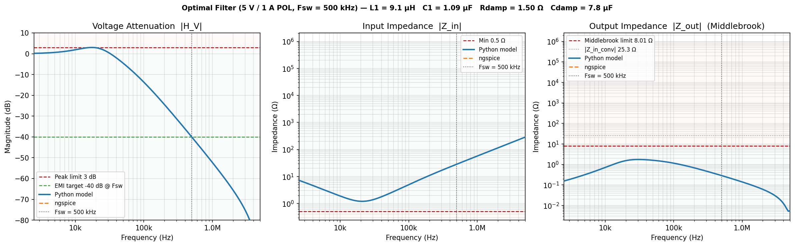

# DC/DC Input Filter Optimizer

Differential Evolution optimizer for single-stage LC input filters on point-of-load (POL) DC/DC converters. Designed and validated against a **5 V / 1 A synchronous buck converter** on a 12 V consumer electronics bus (F_sw = 500 kHz).

---

## Problem

A DC/DC converter draws pulsed current from its input rail at the switching frequency. Without a filter, this switching noise couples onto the supply bus — causing conducted EMI failures and potentially destabilising adjacent converters through supply impedance interactions (Middlebrook instability).

A single-stage LC filter with a parallel RC damping network addresses both problems, but the four component values (L1, C1, R\_damp, C\_damp) involve competing constraints:

- More attenuation → larger resonant peak
- Better damping → higher output impedance
- Middlebrook stability → bounds on output impedance
- Conducted emissions → minimum attenuation at F_sw

This tool finds the global optimum automatically.

---

## Method

### Why not just sweep component values?

With four components each spanning three decades of range, a brute-force grid search at even modest resolution (say 50 points per axis) would require 50⁴ = 6.25 million filter evaluations. Each evaluation computes three frequency sweeps across 128 points. That's impractical — and it still wouldn't find a true optimum, just the best grid point.

### Differential Evolution

This project implements **Differential Evolution (DE/rand/1/bin)** — a global optimisation algorithm that works well on problems exactly like this: four continuous parameters, multiple conflicting constraints, no gradient information available.

The algorithm maintains a **population** of 60 candidate designs (each a set of four component values). Every generation, each candidate is challenged by a trial design constructed from three randomly chosen population members:

```
Step 1 — Mutate:   trial = candidate_A + F × (candidate_B − candidate_C)
Step 2 — Crossover: mix trial and current candidate randomly (probability CR per parameter)
Step 3 — Select:   keep whichever scores lower cost
```

`F = 0.7` (mutation scale) and `CR = 0.7` (crossover probability) are standard DE settings. The population converges when all 60 candidates have clustered to within 1×10⁻⁸ of each other.

The key insight is the **difference vector** in Step 1: by scaling the gap between two existing candidates and adding it to a third, the algorithm automatically adapts its step size to the current spread of the population — large exploratory jumps early on, fine-grained refinement near convergence. Unlike gradient descent, it cannot get trapped in a local minimum because the entire population explores in parallel.

### Cost function

Each candidate design is scored by computing the filter's frequency response analytically (including parasitics) and checking it against four constraints. Violations are penalised quadratically — a design that misses a spec by 2× costs four times more than one that misses by 1×:

| Constraint | Reference | Target |
|---|---|---|
| Resonance peaking | Damping requirement | ≤ 3 dB |
| Filter input impedance | Source protection | ≥ 0.5 Ω |
| Filter output impedance | Middlebrook stability criterion | ≤ Z\_in,conv / 10 dB |
| Attenuation at F\_sw | Conducted emissions limit | ≤ −40 dB |

A small secondary term (1% weight) biases toward smaller component values once all constraints are satisfied, acting as a physical size tiebreaker.

Transfer functions are computed analytically in the frequency domain, including component parasitics (inductor DCR, capacitor ESR and parasitic inductance). Results are cross-validated against **ngspice** SPICE AC simulations.

---

## Filter Topology

```
n_in ──L1(+DCR)──┬── n_out
                 ├── C1 ─────────── GND
                 └── R_damp─C_damp─ GND
```

The parallel RC damping network (R\_damp + C\_damp) damps the LC resonance without dissipating energy at DC, keeping efficiency high.

---

## Results — 5 V / 1 A POL, F_sw = 500 kHz

| Component | Optimal value |
|---|---|
| L1 | 9.1 µH |
| C1 | 1.09 µF |
| R\_damp | 1.50 Ω |
| C\_damp | 7.77 µF |

All four constraints satisfied. Converged in ~300 generations.



*Three-panel Bode plot: voltage attenuation, input impedance, and output impedance. Solid line = Python analytical model, dashed = ngspice SPICE simulation.*

---

## Stack

- **Python 3** — standard library only (no numpy, no scipy)
- **ngspice** — SPICE AC simulation for independent validation
- **matplotlib** — response plots

---

## Usage

```bash
python DE_optimization.py
```

Outputs `optimal_filter_response.png` (three-panel Bode: attenuation, input impedance, output impedance — Python model vs ngspice overlay) and `optimal-attenuation.csv`.

Adjust `circuit_parameters`, `specs`, and `bounds` at the top of `DE_optimization.py` to target a different converter.

---

## License

MIT
